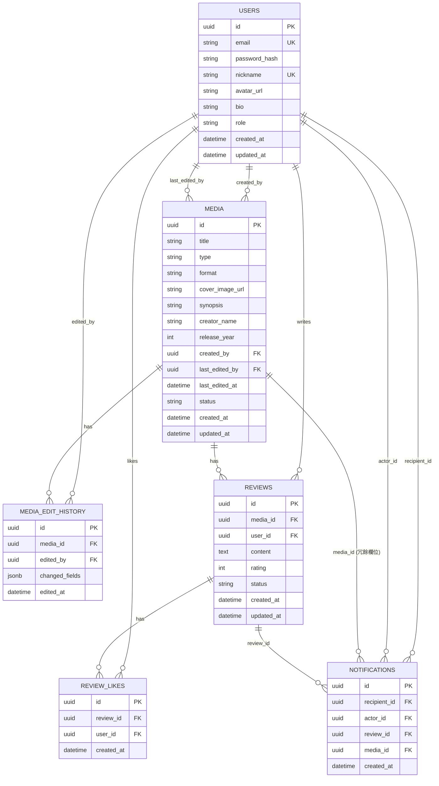

# 資料實體設計

回主文件：[後端規劃.md](./後端規劃.md)

## 【資料實體設計】

```
users
  id, email, password_hash, nickname, avatar_url, bio, role,
  created_at, updated_at
  
  role: 'member' | 'admin'
  bio: 自我介紹，選填，純文字（不支援 Markdown），有長度上限（例如 200 字）
  ⚠️ nickname 全站唯一（unique constraint），註冊與編輯個人主頁時都需檢查

media  (跨五種類型統一管理，任何登入會員皆可建立/編輯)
  id, title, type,
  format,                            ← 收看/閱讀平台
  cover_image_url,                   ← 上傳的封面圖
  synopsis,                          ← 大綱介紹
  creator_name,                      ← 作者/導演名稱
  release_year,
  created_by,                        ← 最初建立者（保留紀錄用途，非權限依據）
  last_edited_by,                    ← 最後編輯者 ⭐
  last_edited_at,                    ← 最後編輯時間 ⭐
  status, created_at, updated_at
  
  type:   'book' | 'movie' | 'series' | 'comic' | 'animation'
  format: 書/漫畫 → 'physical' | 'ebook'
          電影/影集/動畫 → 'streaming' | 'theater'
  status: 'published' | 'removed'    ← 管理員下架機制

media_edit_history  (媒體編輯歷史，記錄每次異動) ⭐
  id, media_id, edited_by, changed_fields (jsonb), edited_at
  
  ⚠️ 這張表讓「最後編輯者」有完整歷史可查，
     不只是覆蓋式記錄，展示稍微進階的資料異動追蹤設計

reviews  (會員針對某媒體發表的心得，僅本人可編輯/刪除)
  id, media_id, user_id, content, rating (1-5),
  status, created_at, updated_at
  
  status: 'published' | 'removed'    ← 管理員下架機制
  ⚠️ 一個會員對同一媒體只能有一篇心得（unique(media_id, user_id)）

review_likes  (心得的愛心紀錄) ⭐
  id, review_id, user_id, created_at
  
  ⚠️ 一個人對同一則心得只能按一次愛心（unique(review_id, user_id)）
  ⚠️ 不能對自己的心得按愛心（寫入時驗證 review.user_id !== req.user.id）

notifications  (愛心通知) ⭐
  id, recipient_id,      ← 通知要給誰看（心得的原作者）
      actor_id,          ← 誰按的愛心
      review_id,         ← 被按愛心的心得
      media_id,          ← 冗餘欄位，省去通知列表時多一次 join 查詢媒體資訊
      created_at
  
  ⚠️ 每次按愛心都新增一筆獨立通知，同一則心得被多人按愛心會產生多筆通知，不合併
  ⚠️ 沒有 is_read 欄位，通知頁單純顯示最近 N 筆列表，不做已讀/未讀狀態
```

**共 6 個實體**：User, Media, MediaEditHistory, Review, ReviewLike, Notification

### ER Diagram




---

## 【媒體欄位設計】


| 欄位                                  | 說明                                                                      | 適用類型      |
| ----------------------------------- | ----------------------------------------------------------------------- | --------- |
| `type`                              | book / movie / series / comic / animation                               | 全部        |
| `format`                            | 書/漫畫：`physical`（紙本）／`ebook`（電子版） 電影/影集/動畫：`streaming`（串流）／`theater`（院線） | 依類型顯示對應選項 |
| `cover_image_url`                   | 上傳的封面圖                                                                  | 全部        |
| `synopsis`                          | 大綱介紹                                                                    | 全部        |
| `creator_name`                      | 作者／導演／原作                                                                | 全部        |
| `last_edited_by` / `last_edited_at` | 最後編輯者與時間，前端顯示為「上次更新：小明・3 天前」                                            | 全部        |


多集影劇（劇集/動畫/漫畫）**不分集管理**，整部作品視為一筆 media 資料。
